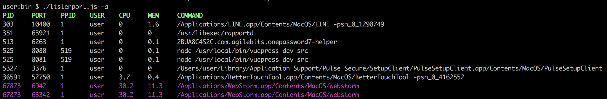

# listenport

Print process information of currently listening port.

[](https://www.npmjs.com/package/@norux/listenport)
[](https://travis-ci.org/norux/listenport)

## How to install

**Install latest**
```bash
$ npm i -g @norux/listenport
```

## Usage



### Examples
```bash
$ listenport -a
$ listenport -p 8080
$ listenport -r 8080:8090
```

### Options

|Short option|Long option|Description|
|------------|-----------|-----------|
|-v|--version|Print current version|
|-h|--help|Print help message|
|-p \<port\>|--port \<port\>|Find process listening port|
|-r \<start\>:\<end\>|--range \<start\>:\<end\>|Find all process between start and end listening port|
|-a|--all|Find all process listening| 

### Process alert

If certain process use either CPU or Memory a lot, its color is change. (red/magenta/yellow)

Usage over the
  * 70%: Red
  * 50%: Magenta
  * 30%: Yellow

## Contribution
   
* slack: [norux#listenport](https://norux.slack.com/messages/CHX4U9161)
